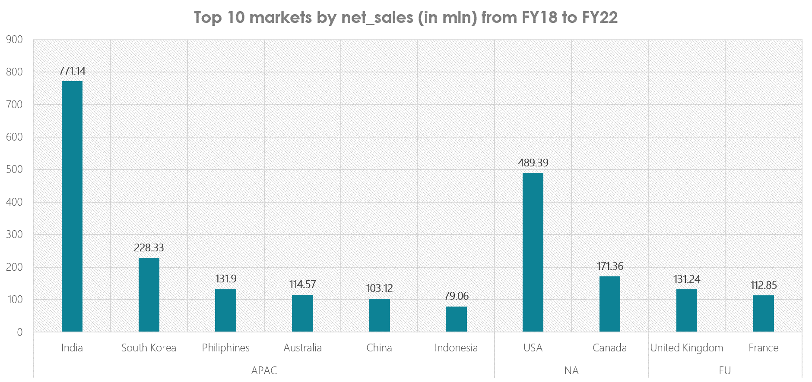

# 🗄️ SQL Data Analysis Project: AtliQ Hardware Business Intelligence
## 📌 Project Overview
This project demonstrates how SQL-driven analysis can generate actionable insights for AtliQ Hardware company. Using sales, customer, product, and supply chain data (2017–2022), I performed end-to-end business analysis to address challenges in: 
•	Revenue Optimization: Identifying underperforming markets/products and evaluating discount strategies. 
•	Market Expansion: Assessing India’s market potential as a growth driver. 
•	Forecast Accuracy & Supply Chain Efficiency: Reducing costs and stockouts through better demand forecasting. 
•	Customer & Product Insights: Segmenting customers, analyzing product mix, and identifying retention opportunities. 

👉 The goal was to convert raw transactional data into strategic recommendations that drive growth, efficiency, and profitability. 

## 🛠 Tech Stack 
•	SQL (MySQL) → Core data querying, cleaning, and transformation 
•	MySQL Workbench → Query development and testing 
•	Python (Pandas, Matplotlib, Seaborn) → Exploratory analysis and visualizations 
•	PowerPoint → Presenting results and dashboards 
•	Git → Version control for queries and documentation 

## 📂 Dataset 
•	Source: AtliQ Hardware Database (sample version shared here due to copyright restrictions) 
•	Schema: Star schema 
•	Dimension Tables: dim_customer, dim_product, dim_date 
•	Fact Tables: fact_sales_monthly, fact_gross_price, fact_manufacturing_cost, fact_forecast_monthly, fact_freight_cost, fact_post_invoice_deductions, fact_pre_invoice_deductions 
•	Period: FY2017 – FY2022 
•	Key Metrics: sold_quantity, gross_price, net_sales, forecast_accuracy 

## 📊 Key Analyses

### 🔹 Financial Analysis 
•	APAC leads in total sales; India contributes significantly within APAC. 
•	Discounting impacts profitability differently across regions. 

Example Query – Top 10 Markets by Net Sales 

SELECT c.market, 
       ROUND(SUM(s.sold_quantity * g.gross_price)/1000000, 2) AS net_sales_mln 
FROM fact_sales_monthly s 
JOIN dim_customer c ON s.customer_code = c.customer_code 
JOIN fact_gross_price g ON s.product_code = g.product_code 
                       AND s.fiscal_year = g.fiscal_year 
GROUP BY c.market 
ORDER BY net_sales_mln DESC 
LIMIT 10; 

### 🔹 Customer Analysis 
•	Segmented customers into High (28%) / Medium (32%) / Low (40%) value. 
•	Medium-value customers offer the largest growth opportunity. 
•	E-commerce platforms like Amazon & Flipkart sustain 1500+ day customer lifetimes. 

Example Query – Customer Segmentation by Revenue Contribution 

WITH customer_revenue AS ( 
    SELECT c.customer_code, 
           c.customer, 
           SUM(s.sold_quantity * g.gross_price) AS total_revenue 
    FROM fact_sales_monthly s 
    JOIN dim_customer c ON s.customer_code = c.customer_code 
    JOIN fact_gross_price g ON s.product_code = g.product_code 
                           AND s.fiscal_year = g.fiscal_year 
    GROUP BY c.customer_code, c.customer 
) 
SELECT customer, 
       total_revenue, 
       CASE  
         WHEN total_revenue >= 100000000 THEN 'High Value' 
         WHEN total_revenue BETWEEN 50000000 AND 100000000 THEN 'Medium Value' 
         ELSE 'Low Value' 
       END AS customer_segment 
FROM customer_revenue 
ORDER BY total_revenue DESC; 

### 🔹 Product Analysis 
•	Computer peripherals (Mouse & Keyboards) lead sales (~70M units). 
•	Storage devices & high-performance components show strong demand. 
•	Smaller accessories highlight cross-selling opportunities. 

Example Query – Top Products by Quantity Sold 

SELECT p.product, 
       ROUND(SUM(s.sold_quantity)/1000000, 2) AS qty_sold_mln 
FROM fact_sales_monthly s 
JOIN dim_product p ON s.product_code = p.product_code 
GROUP BY p.product 
ORDER BY qty_sold_mln DESC 
LIMIT 10; 

### 🔹 India Market Deep Dive 
•	E-Commerce dominates (Amazon ₹240M+, Flipkart ₹108M). 
•	Brick & Mortar (Vijay Sales, Propel, Electricalsocity) remain significant. 
•	India delivers 4–6x higher revenue per customer vs. other markets. 

Example Query – Top Customers in India 

SELECT c.customer, 
       ROUND(SUM(s.sold_quantity * g.gross_price)/1000000, 2) AS revenue_inr_mln, 
       c.platform 
FROM fact_sales_monthly s 
JOIN dim_customer c ON s.customer_code = c.customer_code 
JOIN fact_gross_price g ON s.product_code = g.product_code 
                       AND s.fiscal_year = g.fiscal_year 
WHERE c.market = 'India' 
GROUP BY c.customer, c.platform 
ORDER BY revenue_inr_mln DESC 
LIMIT 10; 

### 🔹 Supply Chain Analysis 
•	Forecast accuracy ~45% vs. 80% target → major inefficiencies. 
•	Even top accounts (Amazon, Walmart) show accuracy gaps. 
•	Opportunity to implement ML/AI forecasting models. 

Example Query – Forecast Accuracy by Customer 

SELECT c.customer, 
       ROUND(SUM(f.forecast_quantity)/SUM(s.sold_quantity) * 100, 2) AS forecast_accuracy_pct 
FROM fact_sales_monthly s 
JOIN dim_customer c ON s.customer_code = c.customer_code 
JOIN fact_forecast_monthly f ON s.product_code = f.product_code 
                            AND s.fiscal_year = f.fiscal_year 
                            AND s.date = f.date 
GROUP BY c.customer 
ORDER BY forecast_accuracy_pct ASC 
LIMIT 10; 

### 🔹 Comparative Market Analysis 
•	India’s revenue grew ~35x (₹26M → ₹910M) between 2018–2022. 
•	Other regions have larger customer bases but much lower per-customer revenue. 

Example Query – Revenue Trend India vs. Other Markets 

SELECT fiscal_year, 
       SUM(CASE WHEN market = 'India' THEN s.sold_quantity * g.gross_price ELSE 0 END) AS india_revenue, 
       SUM(CASE WHEN market <> 'India' THEN s.sold_quantity * g.gross_price ELSE 0 END) AS other_revenue 
FROM fact_sales_monthly s 
JOIN dim_customer c ON s.customer_code = c.customer_code 
JOIN fact_gross_price g ON s.product_code = g.product_code 
                       AND s.fiscal_year = g.fiscal_year 
GROUP BY fiscal_year 
ORDER BY fiscal_year; 

## 🚀 Business Impact & Recommendations 
•	Prioritize India → Allocate resources to scale in a high-efficiency market. 
•	Engage Medium-Value Customers → Loyalty programs & upselling campaigns. 
•	Diversify Products & Customers → Reduce dependency on top 20% revenue contributors. 
•	Improve Forecasting Models → Deploy ML/AI models to increase accuracy from 45% → 70%+. 
•	Strengthen E-commerce Partnerships → Deepen engagement with Amazon & Flipkart. 
•	Scale Best Practices Globally → Replicate India’s success in other APAC markets. 

## 📷 Screenshots / Visuals 
The repository includes: 
•	ERD of database schema 
•	SQL scripts for each analysis block 
•	Charts on customer segmentation, market comparison, and product trends 

## 📈 Project Impact 
✔ Solved reporting gaps through segmentation & visibility 
✔ Identified revenue risks and forecasting inefficiencies 
✔ Highlighted India vs. global growth opportunities 
✔ Enabled data-driven decisions across finance, product, customer, and supply chain 
